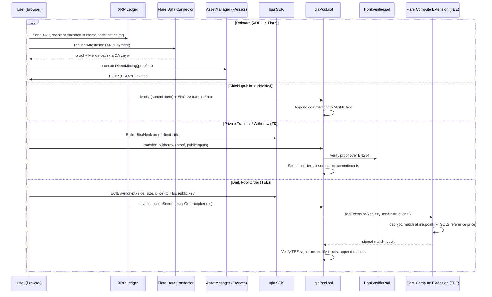
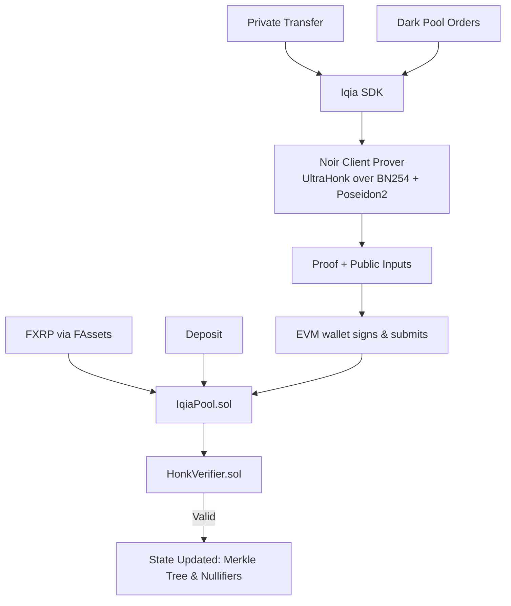

  

<h1 align="center">Iqia</h1>

  A confidential trading layer on Flare — hold shielded balances behind zero-knowledge proofs, and trade on a dark pool whose matching engine runs inside a Trusted Execution Environment. Orders are encrypted end-to-end, matched without ever being seen, and settled on-chain against a TEE signature.

  
  
  
  
  

  <a href="#status">Status</a> ·
  <a href="#overview">Overview</a> ·
  <a href="#why-iqia">Why Iqia</a> ·
  <a href="#prior-work-vs-new-work">Prior vs New Work</a> ·
  <a href="#the-system-flows">System Flows</a> ·
  <a href="#architecture">Architecture</a> ·
  <a href="#quick-start">Quick Start</a>

---

## Overview

Iqia is a confidential trading layer on Flare. A user shields a balance — it becomes a
Poseidon2 note commitment in a Merkle tree, with amount and owner sealed inside the hash. From
there they can transfer value privately, withdraw back to a public address, or place an order
on a dark pool where **the matching engine itself runs inside a Trusted Execution Environment**.

Orders are ECIES-encrypted to the TEE's public key before they ever touch the chain. Inside the
enclave they are decrypted, matched at the midpoint, and the result is signed. Only that
signed result reaches the chain: which notes were spent and what was created — never the side,
the size, or the limit price. The operator running the service cannot see the order book either.

Every state transition *out* of the shielded layer is gated by a **zero-knowledge UltraHonk
proof generated client-side** (compiled from Noir circuits) and verified on-chain.

> **One pool. Five flows. One rule: your balances, transactions, and orders stay private.**
>
> - **Onboard** brings XRP from XRPL to Flare as FXRP, attested by the Flare Data Connector.
> - **Shield (Deposit)** moves a public balance into the pool, turning it into a note commitment.
> - **Private Pay (Transfer)** pays another user inside the pool with hidden amounts and links.
> - **Swap (Dark Pool)** — encrypted orders matched inside a TEE, settled against its signature.
> - **Private Withdraw** cashes out shielded notes back to any public Flare address.

---

## Why Iqia

A public blockchain publishes your intent before it executes. On any on-chain order book or AMM,
the size, the direction, and the price you will accept are visible the moment the transaction is
broadcast — long enough to be front-run, and permanently enough that competitors can reconstruct
your positioning afterwards. For anyone moving size, that is not a privacy nicety; it is a
direct, measurable cost paid in slippage.

The existing options fall short:
- **Splitting orders across wallets and days** — trades execution cost for time cost, and funding
  trails relink the wallets anyway.
- **Centralized dark pools** — restore confidentiality by taking custody and asking you to trust
  an operator who can see everything and trade against you.
- **On-chain "private" DEXes without confidential compute** — the matching logic still executes
  in public, so the book leaks even when balances do not.

**How do you match orders without anyone — including the operator — seeing the book, while still
settling verifiably on-chain and never taking custody?**

Iqia's answer, built on Flare's enshrined protocols:

1. **Client-side UltraHonk proving (Noir)** — proofs generated in the browser. Secret inputs
   (note keys, amounts, blinding factors) never leave the device. Poseidon2 over BN254, off-thread.
2. **Shielded note pool** — deposits create commitments in an on-chain Merkle tree. Spending
   reveals only a nullifier, so old and new notes never link.
3. **On-chain verification** — UltraHonk verifier contracts over BN254. Flare supports all EVM
   opcodes through Cancun, so the BN254 pairing precompile needed for Honk verification is available.
4. **A matching engine inside a TEE** — see below. This is the part ZK cannot do.
5. **FDC instead of a hand-rolled bridge** — the Flare Data Connector attests XRPL payments
   natively (`FdcHub.requestAttestation` → `FdcVerification`), so there is no light client and
   no trusted relayer to build or operate.

### Why a TEE, when we already have zero-knowledge proofs

This is the crux of the design, and it is a structural argument rather than a preference.

> A zero-knowledge proof proves a statement made by **one** prover about **their own** data.
> Order matching is inherently **multi-party** — it requires seeing two different users' orders
> at the same time. A single ZK proof cannot do that, no matter how the circuit is written.

That leaves three options: a trusted operator (which destroys the premise), MPC (expensive and
complex), or a **TEE**. Flare Confidential Compute provides the third as a protocol the network
itself secures. So the split is clean, not decorative:

| Layer | Mechanism | Why |
|---|---|---|
| Deposit / withdraw / transfer | **ZK** (Noir + UltraHonk) | Single-party statements: "I own this note, here is its nullifier" |
| Order matching | **TEE** (Flare Compute Extension) | Multi-party computation over secret inputs — ZK structurally cannot |
| Settlement | On-chain | TEE signature + nullifiers verified by the pool contract |

Trust assumptions are stated plainly in [plan-migrate.md](./plan-migrate.md) §2b, including the
ones the ZK layer does **not** carry: AMD for SEV integrity, and Google for Confidential Space
and the vTPM attestation chain.

<b>Meet Sarah</b> — the person this is for

 

Sarah manages a small treasury and needs to rotate a meaningful position. On a public DEX her
intent is visible the moment it hits the mempool: the size, the direction, the price she will
accept. Bots front-run her, she eats the slippage, and her competitors learn her positioning
from the chain afterwards. Splitting the order across days and wallets only trades one cost for
another. With Iqia she shields the balance, submits an order encrypted to the enclave, and it
is matched at the midpoint against a counterparty who is equally invisible. Nothing about her
intent is public — before, during, or after — yet the settlement is verified on-chain and she
never hands custody to anyone.

---

## Prior work vs new work

The Flare Summer Signal submission requires a clear separation between what existed before and
what is new. This is that separation.

### Existed before (built on Stellar/Soroban)

- The 5 Noir circuits (`withdraw`, `transfer`, `place_order`, `match_orders`, `cancel_order`)
  and the shared `iqia_lib`.
- The TypeScript SDK: Poseidon2, Merkle tree, note/nullifier derivation, client-side proving.
- The React frontend and its flows.
- A working Soroban deployment on Stellar Testnet, with an end-to-end private round-trip
  verified on-chain using a real 14,592-byte UltraHonk proof (deposit 1 XLM → shielded note →
  ZK withdraw). That deployment is **prior work and is no longer the target**; its contract
  workspace has been removed from this tree.

### Ported / integrated / newly built for Flare

- **Removed** the entire hand-rolled trust-minimized bridge — Ethereum sync-committee BLS
  verification, Merkle-Patricia storage proofs, SSZ, and the finality relayer (~4 Rust crates
  plus a TypeScript relayer). Flare's FDC provides this natively. This is a deliberate
  simplification, not a loss of scope: it replaces bespoke cryptography we had to maintain with
  an enshrined protocol the network already secures.
- **Retargeted the verifiers** from Soroban WASM to Solidity. The circuits already build with a
  keccak transcript, which is exactly what `bb write_solidity_verifier --scheme ultra_honk`
  requires — so the proving format carries over unchanged.
- **Rewriting** the pool contract and the SDK/frontend transaction layer for EVM (viem/wagmi).
- **New**: the matching engine moves from an ordinary off-chain TypeScript service into a Flare
  Compute Extension running in a TEE — the single biggest change, and the one the track is about.
  Orders arrive ECIES-encrypted; the operator never sees the book.
- **New**: FXRP onboarding through FAssets, with direct minting as the target flow.

See [plan-migrate.md](./plan-migrate.md) for the phase breakdown and the risks.

---

## The System Flows

Iqia coordinates several flows against one shielded pool, changing only the circuit and public inputs.

| Flow | **Onboard (FXRP)** | **Shield (Deposit)** | **Private Pay (Transfer)** | **Swap (Dark Pool)** | **Private Withdraw** |
|---|---|---|---|---|---|
| **Direction** | XRPL → Flare | Flare public → shielded | Shielded → shielded | Shielded → shielded | Shielded → Flare public |
| **Mechanism** | FDC attestation + FAssets minting | ERC-20 `transferFrom` | `transfer` circuit | **TEE matching engine** + signed settlement | `withdraw` circuit |
| **Inputs/Outputs** | XRPL payment + `XRPPayment` proof | Public FXRP | 2 input notes → 2 output notes | Order commitment & notes | Input note → public recipient |
| **Recipient** | Flare address (encoded in XRPL memo/destination tag) | Shielded key | Shielded key | Shielded key | Public Flare address (`0x…`) |
| **Effect** | FXRP minted | Note commitment created | Inputs nullified, outputs created | Funds locked, traded, settled | Input nullified, tokens out |
| **What stays hidden** | — (public by design) | In-pool balance | Amount, asset, sender → receiver link | Side, size, price, match | Amount, asset, withdraw source |

---

## Architecture

### Target system flow

### Proof pipeline

---

## Tech Stack

| Layer | Technology |
|---|---|
| **Frontend** | React 18, Vite, Tailwind CSS v3, Three.js, React Three Fiber |
| **Wallet** | EVM wallets via `wagmi` / `viem` |
| **Blockchain** | Flare Coston2 testnet (chainId 114), XRP Ledger testnet |
| **Flare protocols** | Flare Confidential Compute (FCC/TEE), FTSOv2 (midpoint reference price), FDC + FAssets/FXRP (asset onboarding) |
| **TEE** | Flare Compute Extension in Go, GCP Confidential Space on AMD SEV, vTPM attestation |
| **Zero-Knowledge** | Noir (`1.0.0-beta.9`), Barretenberg (`0.87.0`), UltraHonk over BN254, Poseidon2 |
| **Contracts** | Solidity, Foundry |
| **Off-chain Matcher** | TypeScript order matching engine |

---

---

## Hackathon

| | |
|---|---|
| **Event** | Flare Summer Signal |
| **Bounty** | Bounty 2 — Confidential Compute Apps |
| **Network** | Flare Coston2 testnet (chainId 114) |

---

## License

Iqia application code is released under the **MIT License**.

---

<i>Your balances, transactions, and orders stay completely private. Iqia.</i>

