<p align="center">
  
</p>

<h1 align="center">Iqia</h1>

<p align="center">
  Liquidity that always stays unlocked.<br />
  A consumer app on 1inch Aqua where the pricing strategy is a SwapVM program you can read.
</p>

<p align="center">
  <a href="https://qia-1inch.vercel.app"></a>
  
  
</p>

<p align="center"><em>Powered by SwapVM — © Degensoft Ltd 2025</em></p>

---

<p align="center">
  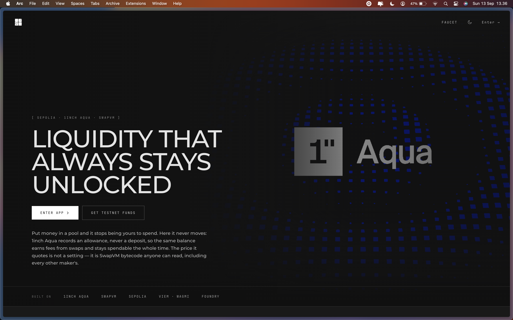
</p>

Put money in a liquidity pool and it stops being yours to spend. Here it never moves: 1inch Aqua records an **allowance**, never a deposit, so the same balance earns fees from swaps **and stays spendable the whole time**. The price it quotes is not a setting — it is SwapVM bytecode anyone can read, including every other maker's.

> **Delete our frontend and the product still exists.** Every fact about a position is readable with stock viem and no configuration.
>
> - `getLogs({ event: 'Shipped', address: AQUA })` → every position on the registry, including 10 other teams'
> - `disassemble(strategy)` → the exact instructions your money follows
> - `readContract({ functionName: 'rawBalances', ... })` → real-time backing status

---

## Verifiable on Chain

<p align="center">
  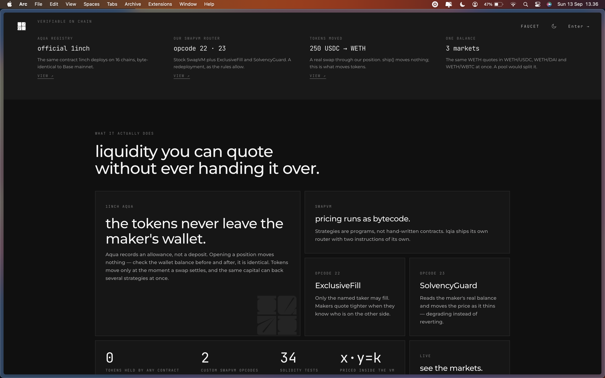
</p>

Every claim Iqia makes is independently verifiable on-chain. No oracle, no off-chain computation, no trust required.

| Fact | How to verify | What you'll find |
|---|---|---|
| **Aqua Registry** — official 1inch | [Basescan](https://basescan.org/address/0x1111113ccf1426a8e30e2bff5e005d929bf6a90a) | The same contract 1inch deploys on 16 chains, byte-identical to Base mainnet |
| **Our SwapVM Router** — opcode 22 · 23 | [Basescan](https://sepolia.basescan.org/address/0x970C3114C5Dcf853692bc8D3e0598d1AC9D12185) | Stock SwapVM plus ExclusiveFill and SolvencyGuard. A redeployment, as the rules allow |
| **Tokens Moved** — 250 USDC → WETH | `Pulled` event on Aqua | A real swap through our position. `ship()` moves nothing; this is what moves tokens |
| **One Balance** — 3 markets | `rawBalances()` on Aqua | The same WETH quotes in WETH/USDC, WETH/DAI and WETH/WBTC at once. A pool would split it |

| | |
|---|---|
| **0** tokens held by any contract | **2** custom SwapVM opcodes |
| **34** Solidity tests | **x · y = k** priced inside the VM |

---

## The Problem

<p align="center">
  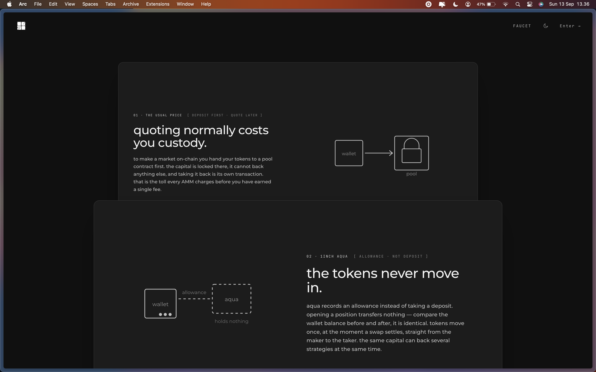
</p>

### 01 · The Usual Price — Deposit First, Quote Later

**Quoting normally costs you custody.**

To make a market on-chain you hand your tokens to a pool contract first. The capital is locked there, it cannot back anything else, and taking it back is its own transaction. That is the toll every AMM charges before you have earned a single fee.

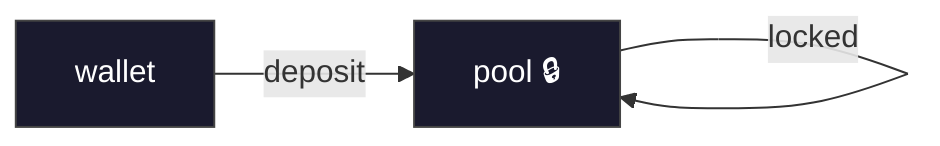

Your tokens sit idle in a contract you don't control. The strategy is the pool's constant-product formula — no customization, no flexibility, no ownership.

### 02 · 1inch Aqua — Allowance, Not Deposit

**The tokens never move in.**

Aqua records an **allowance** instead of taking a deposit. Opening a position transfers nothing — compare the wallet balance before and after, it is identical. Tokens move once, at the moment a swap settles, straight from the maker to the taker. The same capital can back several strategies at the same time.

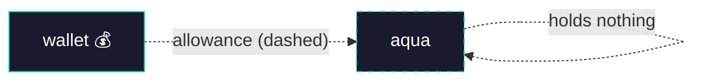

The dashed line is the key insight: Aqua never touches your tokens. It records that you *allow* a certain amount to be quoted, but the actual balance stays in your wallet, spendable at any moment.

---

## What It Actually Does

**Liquidity you can quote without ever handing it over.**

### 1inch Aqua — The tokens never leave the maker's wallet

Aqua records an allowance, not a deposit. Opening a position moves nothing — check the wallet balance before and after, it is identical. Tokens move only at the moment a swap settles, and the same capital can back several strategies at once.

### SwapVM — Pricing runs as bytecode

Strategies are programs, not hand-written contracts. Iqia ships its own router with two instructions of its own:

| Opcode | Name | What it does |
|---|---|---|
| **22** | `EXCLUSIVE_FILL` | Only the named taker may fill. Makers quote tighter when they know who is on the other side. Full 20-byte address comparison — not the 10-byte "almost certainly them" of SwapVM's `PrivateOrder`. |
| **23** | `SOLVENCY_GUARD` | Reads the maker's real balance and moves the price as it thins — degrading instead of reverting. No oracle, no keeper, no extra transaction. |

---

## The Strategy Is a Program

<p align="center">
  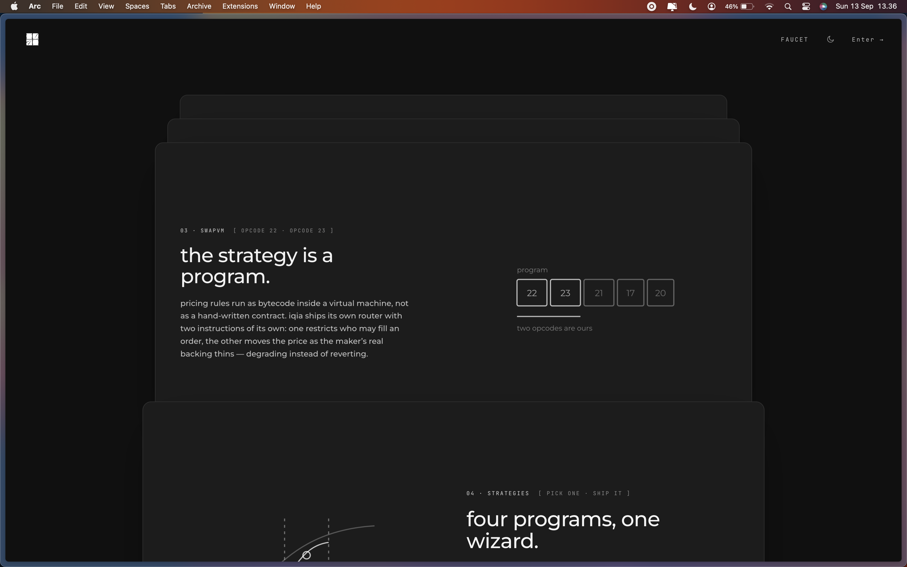
</p>

Pricing rules run as bytecode inside a virtual machine, not as a hand-written contract. Iqia ships its own router with two instructions of its own: one restricts who may fill an order, the other moves the price as the maker's real backing thins — degrading instead of reverting.

### SwapVM Instruction Format

Every strategy is a sequence of instructions. Each instruction is: `[opcode 1 byte][length 1 byte][arguments]` — max 255 bytes per instruction.

```
program: [22] [23] [21] [17] [20]
          │    │    │    │    │
          │    │    │    │    └── SALT: makes the strategy hash unique
          │    │    │    └── XYC_SWAP: constant-product curve x·y=k
          │    │    └── FLAT_FEE_IN: flat fee taken from input side
          │    └── SOLVENCY_GUARD: reads real wallet backing
          └── EXCLUSIVE_FILL: gate by address (full 20 bytes)
```

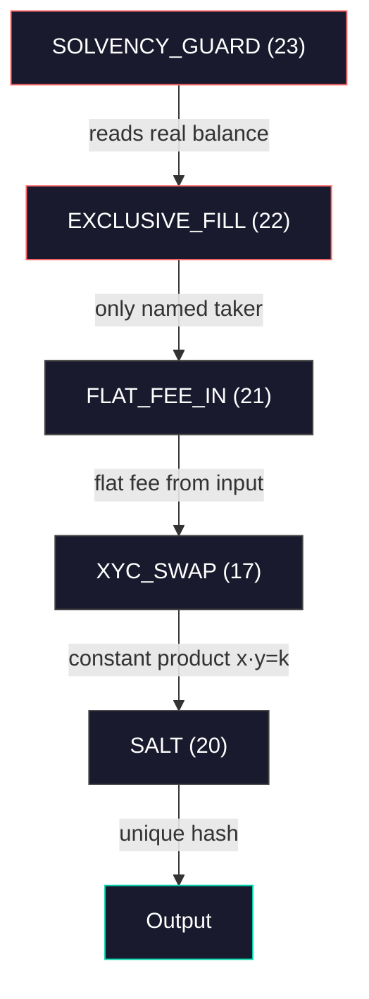

**Key invariants:**
1. `flatFeeIn` must be **AFTER** `xycConcentrate`
2. `solvencyGuard` must be **BEFORE** any balance-shaping instruction
3. Protocol fee precedes maker fee
4. No external yield — earnings come only from swap fees

---

## Four Programs, One Wizard

<p align="center">
  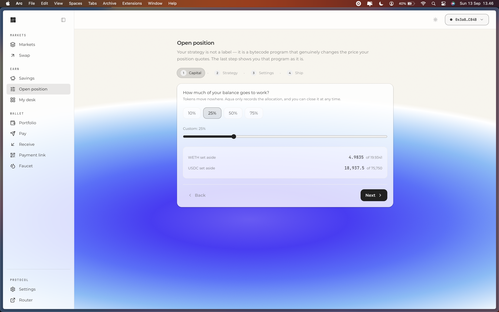
</p>

### Savings — One slider, one button

The simplest entry point. You decide how much of your balance goes to work, and the app opens a position automatically. If you only hold one token, it swaps half first and then opens — two signatures, one decision.

### Open Position — 4-step wizard for advanced strategies

| Step | What you decide |
|---|---|
| **1. Capital** | How much of your balance goes to work? Tokens move nowhere — Aqua only records the allocation. |
| **2. Strategy** | Which program? Relaxed, Concentrated, Anti-arbitrage, or Private desk. |
| **3. Settings** | Strategy-specific parameters — price bands, decay rates, exclusive fill address. |
| **4. Ship** | Review the bytecode program, then ship it. The last step shows you the exact program as it is. |

### Strategy Comparison

| ID | Name | Opcodes | Behavior |
|---|---|---|---|
| `santai` | Relaxed | solvencyGuard → flatFeeIn → xycSwap | Quotes whole price range. Lowest earnings per capital. |
| `terkonsentrasi` | Concentrated | solvencyGuard → xycConcentrate → flatFeeIn → xycSwap | Liquidity in one price band. Higher earnings, stops earning outside band. |
| `anti-arbitrase` | Anti-arbitrage | solvencyGuard → decay → flatFeeIn → xycSwap | Quote catches up gradually after price moves. Anti-MEV. |
| `meja-privat` | Private desk | exclusiveFill → solvencyGuard → flatFeeIn → xycSwap | Only named address can fill. Tighter quotes for known flow providers. |

---

## Swap — On-Chain Quotes

<p align="center">
  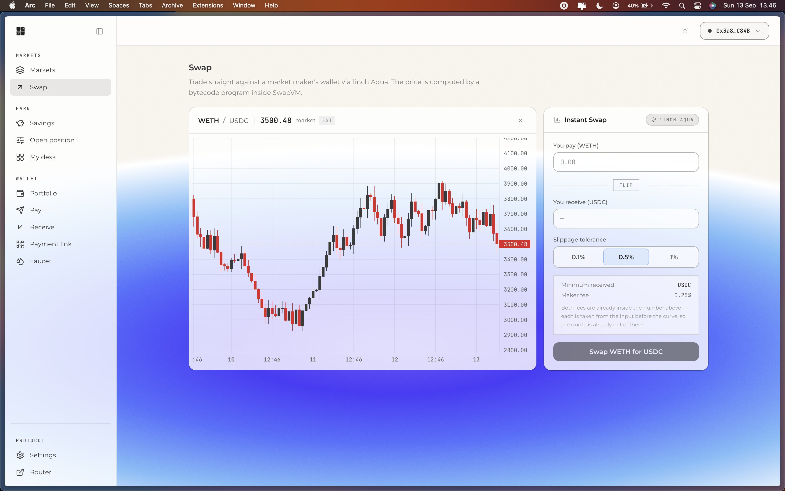
</p>

Trade straight against a market maker's wallet via 1inch Aqua. The price is computed by a bytecode program inside SwapVM.

### How a Swap Settles

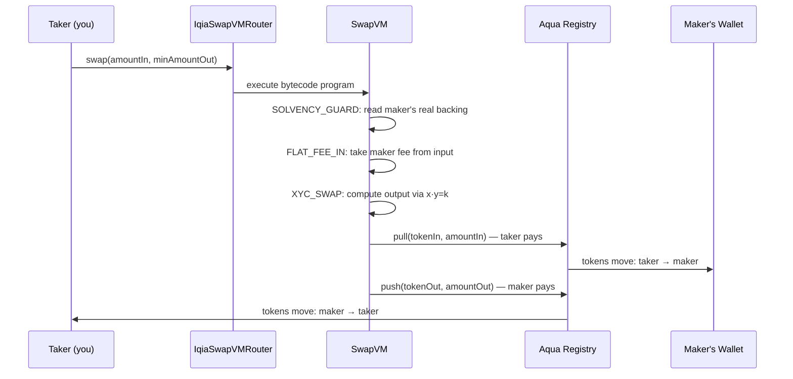

The key insight: `pull()` and `push()` happen in the same transaction. The maker's wallet is debited directly — no intermediate pool contract holds the funds.

### Swap Features

- **Real slippage bounds** — minimum received is computed by the VM, not approximated
- **Maker fee visible** — shown as 0.25%, already baked into the quote
- **No off-chain dependency** — every quote is a `eth_call`, not an API request
- **Candlestick chart** — real-time price history from on-chain events

---

## System Architecture

### How Positions Work

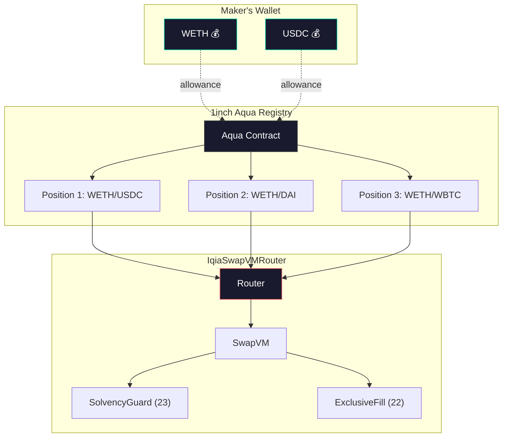

**Critical insight:** The same WETH balance backs 3 markets simultaneously. A pool would force you to split it 3 ways. Aqua lets you keep it all in your wallet and quote from all 3 at once.

### Resolution Pipeline

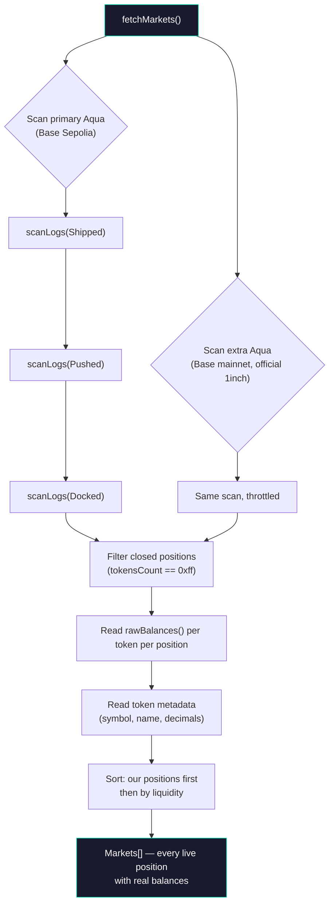

### Position Lifecycle

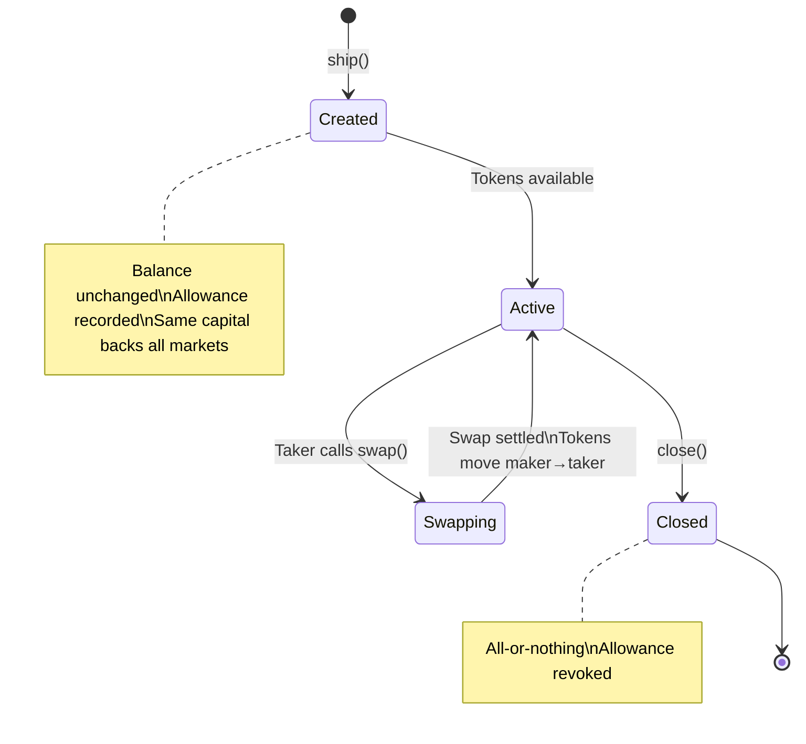

---

## Smart Contracts

### Contract Map

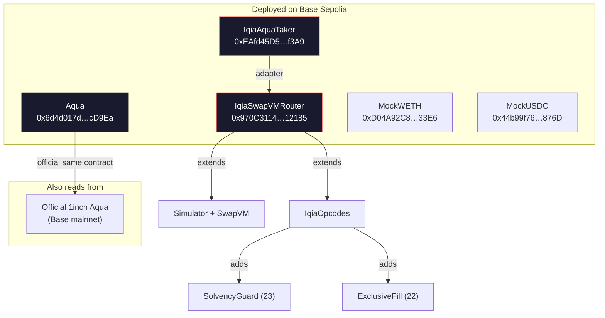

### `IqiaSwapVMRouter.sol`

Extends `Simulator`, `SwapVM`, `IqiaOpcodes`. Serves as both the **strategy execution engine** AND the **Aqua app** — single contract, dual role. Constructor: `(address aqua, address weth, address owner)`.

### `IqiaOpcodes.sol`

Extends `AquaOpcodes`, `ExclusiveFill`, `SolvencyGuard`. Adds opcodes at slots 22 and 23. `_requireFreeSlot()` validates slots are not already taken (runs on every quote/swap).

### `ExclusiveFill.sol` (opcode 22)

Full 20-byte address comparison. `ctx.query.taker` is set by SwapVM from `msg.sender`, cannot be spoofed. Args: 20-byte taker address.

> `test_Gate_RejectsHighBitsCollision` builds an address whose low 80 bits are identical to the named taker. SwapVM's `PrivateOrder` accepts it. We reject it.

### `SolvencyGuard.sol` (opcode 23)

Reads `min(balanceOf, allowance)` for tokenOut. If backing < virtual balance, calculates surcharge: `maxSurchargeBps * (virtual - backing) / virtual`. Must be placed BEFORE any balance-shaping instruction.

> Measured — guard after `concentrate` gives `4.742`, guard before gives `4.913`, identical to no guard at all. Silent failure, no revert.

### `IqiaAquaTaker.sol`

Adapter that lets a liquidity pool act as SwapVM taker without modifying pool contracts. Flow: pool → pulls tokenIn → calls router.swap() → SwapVM callback → push to Aqua → Aqua pulls tokenOut from maker's wallet → forwards to pool.

---

## SwapVM Opcodes Reference

| Opcode | Name | Description |
|---|---|---|
| 10 | `JUMP` | Unconditional jump |
| 13 | `DEADLINE` | Time limit (Unix seconds) |
| 17 | `XYC_SWAP` | Constant-product curve x·y=k |
| 18 | `XYC_CONCENTRATE` | Concentrated liquidity in a price band |
| 19 | `DECAY` | Virtual balance decays over time, anti-MEV |
| 20 | `SALT` | Makes strategyHash unique (no behavioural change) |
| 21 | `FLAT_FEE_IN` | Flat fee taken from input side |
| 22 | `EXCLUSIVE_FILL` | **(Iqia)** Only a named address may fill — full 20-byte comparison |
| 23 | `SOLVENCY_GUARD` | **(Iqia)** Price adjusts based on real wallet backing |
| 28 | `AQUA_PROTOCOL_FEE_IN` | Protocol fee sent to treasury in the same swap |

**Instruction format:** `[opcode 1 byte][length 1 byte][arguments]` — max 255 bytes per instruction. **BPS basis:** 1e9 (not 10,000).

---

## Run It

```bash
pnpm install
cp frontend/.env.84532 frontend/.env.local   # Base Sepolia deployment
pnpm --filter frontend dev
```

Open [http://localhost:5173](http://localhost:5173). Connect a wallet on Base Sepolia, mint test tokens on **Faucet**, then **Savings → Start**.

Or skip the setup entirely: **[qia-1inch.vercel.app](https://qia-1inch.vercel.app)** runs against the live Base Sepolia deployment. You need a wallet on Base Sepolia with a little test ETH for gas; every token you trade with is mintable from the faucet.

### Checks

```bash
cd contracts && forge test          # 51 tests
pnpm --filter @iqia/swapvm test     # 23 golden vectors, byte-for-byte against Solidity
pnpm --filter frontend lint         # clean
```

---

## Operator Scripts

```bash
# One-time: deploy Aqua + Router + first position
cd contracts && ./script/deploy.sh

# Point the desk at the official Aqua registry
cast wallet import desk --interactive
DESK_ACCOUNT=desk ./contracts/script/migrate-to-official-aqua.sh

# Add two more markets from the same WETH capital
DESK_ACCOUNT=desk ./contracts/script/add-markets.sh

# Demo: shared capital backing three markets
DESK_ACCOUNT=desk ./contracts/script/shared-capital.sh
```

Use the Foundry keystore, not a raw key. A key in an environment variable leaks into shell history, the process list, and any log that records the environment.

**RPC:** reads go through `https://sepolia.base.org`, with throttling for Base mainnet public RPC. The app handles rate limiting (429) and silent empty responses from public RPCs gracefully — retry logic with exponential backoff built into `scanLogs`.

---

## Repo

```
contracts/
  src/iqia/                 IqiaSwapVMRouter, IqiaOpcodes
  src/iqia/instructions/    SolvencyGuard, ExclusiveFill
  test/                     12 suites, 51 tests
  script/                   deploy, migrate to official Aqua, add markets
protocol/swapvm/            TypeScript program encoder + disassembler
frontend/
  src/components/           React UI components
  src/pages/                Route pages (Hub, Savings, Strategy, Desk, Swap, Pay, etc.)
  src/lib/                  Config, markets, payments, desk, strategies, wagmi
```

The encoder is not a convenience wrapper. Every program the app ships is built in TypeScript and locked against Solidity output byte-for-byte in `protocol/swapvm/test/golden.test.ts` — if the two ever disagree, the tests fail before a wrong program reaches a wallet.

---

## Tech Stack

| Layer | Technology |
|---|---|
| Frontend | React 18, Vite 5, TypeScript 5.7, Tailwind CSS 3.4 |
| Web3 | viem 2.55, wagmi 2.19, @wagmi/core 3.6 |
| 1inch SDK | @1inch/aqua-sdk ^0.3.1 |
| State | @tanstack/react-query ^5.101 |
| Charts | lightweight-charts 5.2 |
| Protocol SDK | @iqia/swapvm (workspace, zero runtime dependencies) |
| Smart Contracts | Solidity 0.8.30, Foundry, OpenZeppelin 5.4 |
| Blockchain | Base Sepolia (chain 84532) + Base mainnet (chain 8453) read |
| Monorepo | pnpm 10.11 workspaces |

---

## Known Limits

Stated plainly, because a submission that hides them is worth less than one that does not.

- **The protocol fee is best-effort.** `_aquaProtocolFeeAmountInXD` pulls from the maker's *pre-existing* Aqua balance; if it cannot cover it, `ProtocolFeeSkipped` fires and the swap proceeds free. A one-sided position earns the treasury nothing on the common direction.
- **No APY anywhere, deliberately.** Earnings are reconstructed from `Pulled` and `Pushed` events. A forecast dressed as a number is worse than no number.
- **The slot guard costs gas on every swap.** `_opcodes()` runs inside `quote()` and `swap()`, so `_requireFreeSlot` re-answers a question fixed at deploy time. Left alone on purpose — the router is live with positions on it.
- **Partial withdrawal is not implemented.** Closing is all or nothing.
- **Base mainnet public RPC rate limits aggressively.** Extra registry scans are throttled (1 chunk at a time, 800ms delay) to stay under 429 thresholds.

---

## License

Our contracts extend SwapVM and are therefore derivative work: `IqiaOpcodes.sol` and `IqiaSwapVMRouter.sol` fall under **LicenseRef-Degensoft-SwapVM-1.1**, whose §3.1 requires derivative sources to carry the same license, preserve notices, and attribute *"Powered by SwapVM — © Degensoft Ltd 2025"*. The rest of this repository is MIT.

Hackathon use is free under §4. The treasury fee this app can charge is covered by the §5.3 enforcement waiver for market-making activity — a waiver, not a license, and revocable.

Coin icons are linked from [Cryptofonts/cryptoicons](https://github.com/Cryptofonts/cryptoicons) (GPL-3.0) over a CDN rather than bundled, so no GPL asset is redistributed here.
